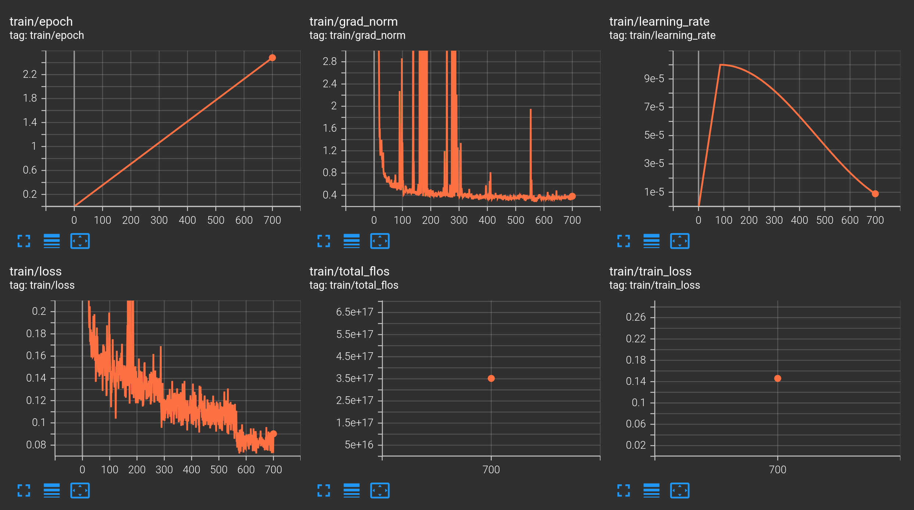
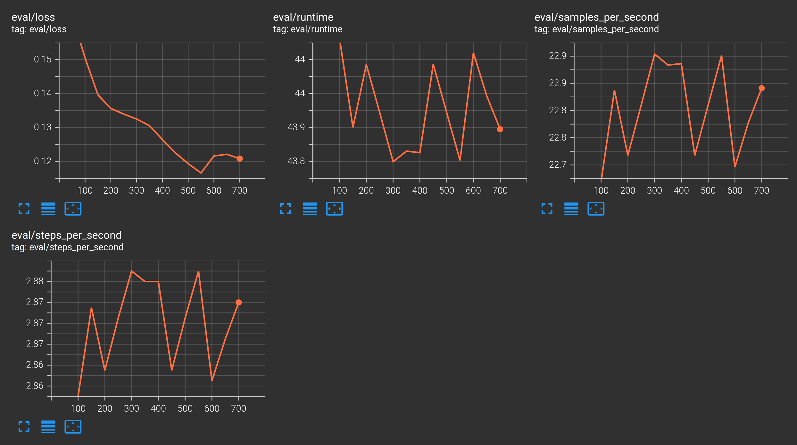

# AuraDSL: Enterprise-Grade Text-to-DSL Pipeline for Phi-4

## 📌 Overview
This project demonstrates a production-grade pipeline for adapting a Large Language Model (Microsoft Phi-4) to a proprietary, synthetic analytics language called **AuraDSL**. 

Standard LLMs struggle with niche Domain Specific Languages (DSLs) due to data scarcity. This repository solves the problem through a **Schema-Driven Synthetic Generation** strategy and **Execution-based Evaluation**, ensuring the model doesn't just "mimic" syntax but understands query logic.

### Key Highlights
*   **Target DSL:** AuraDSL (Pipe-based analytics language: `SOURCE |> FILTER |> AGGREGATE`).
*   **Base Model:** Phi-4 (15B) fine-tuned via QLoRA.
*   **Strategy:** RAG-augmented generation with schema-aware retrieval.
*   **Performance:** Achieved **100% Execution Accuracy** on a zero-shot hold-out test set.

## 🚀 Performance & Training
The model was trained on an **NVIDIA A100 80GB** using the Unsloth framework.

### Training Metrics
We observed rapid convergence. While the initial "warm-up" period showed gradient spikes (common when training `embed_tokens` and `lm_head` for new syntax), the loss stabilized significantly.

| Metric | Value |
| :--- | :--- |
| **Training Loss** | 0.0814 |
| **Eval Loss** | 0.1208 |
| **Execution Accuracy** | 100% |

**Training Visuals:**
| Train Loss | Eval Loss |
| :---: | :---: |
|  |  |
*Note: The gradient spikes visible in Tensorboard were anticipated due to high-rank LoRA adaptation of the output head to the specific AuraDSL token distribution.*

## 🛠 Tech Stack
- **Model:** Microsoft Phi-4 (via Unsloth)
- **Database:** SQLite (Execution environment)
- **Vector Store:** ChromaDB (Schema retrieval)
- **Data Gen:** Python + Qwen-3-235B (Semantic infilling)
- **Orchestration:** Asyncio + HTTPX

## 📂 Project Structure
- `src/schema.py`: Pydantic-based Domain Schema.
- `src/engine/`: AuraDSL-to-SQL Transpiler and Execution engine.
- `src/retrieval/`: ChromaDB-powered RAG for dynamic context.
- `dataset.py`: Synthetic data engine (Skeleton + LLM Infilling).
- `train.py`: Unsloth fine-tuning script.
- `evaluate.py`: Rigorous execution-based evaluation suite.

## 📊 Evaluation Results
Unlike traditional NLP projects that use BLEU/ROUGE scores (which are misleading for code), we utilized **Execution Matching**:
1.  Generate AuraDSL from a natural language prompt.
2.  Translate AuraDSL to SQL.
3.  Execute against a seeded SQLite DB.
4.  Compare results with the "Gold" query.

**Result: 100/100 correct data returns on unseen test cases.**
